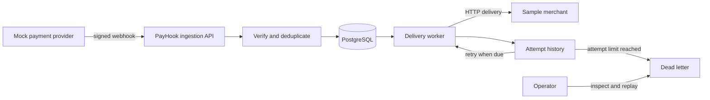

# Project Brief: PayHook

> PayHook is a provisional product name. It may change without changing the curriculum.

## The user and the problem

The user is a developer or small engineering team whose application depends on
payment-provider webhooks. A provider can send events such as
`payment.captured`, `payment.failed`, or `refund.processed`. Delivery is not
perfect: events can be duplicated, delayed, time out, or reach an application
while it is unavailable.

PayHook sits between the provider and the application. It verifies the sender,
accepts the event quickly, records it durably, and then delivers it to the
application with an inspectable history and controlled retry behavior.

## Core flow

## Core V1 capabilities

1. Register/login for the management API.
2. Create sources with signing secrets.
3. Create destinations with target URLs.
4. Receive and verify signed test webhooks.
5. Persist the raw event and essential metadata.
6. Prevent the same provider event from being accepted twice as a new event.
7. Deliver events asynchronously to the destination.
8. Record each attempt, response status, duration, and safe error details.
9. Retry transient failures with bounded exponential backoff and jitter.
10. Move exhausted deliveries to a dead-letter state.
11. Inspect events and attempts through management endpoints.
12. Replay a failed or dead-lettered delivery safely.
13. Expose health/readiness signals and structured logs.
14. Run locally with documented commands and free tooling.

## Supporting applications

### Mock payment provider

Generates realistic events, signs them, and can send duplicates or bursts. It
exists to exercise PayHook without money or a provider account.

### Sample merchant

Receives forwarded events and can deliberately return patterns such as
`500, 500, 200` or delay a response. It exists to demonstrate timeout, retry,
and recovery behavior.

Both supporting applications must remain smaller than the main service.

## V1 non-goals

- Processing payments or storing card details
- Supporting every real payment provider
- Multi-region or exactly-once distributed delivery
- Kafka, Kubernetes, or microservices
- A production billing system
- A polished commercial dashboard
- Redis as the authoritative event or deduplication store
- Guaranteed prevention of duplicate side effects in a badly designed merchant

## Important engineering truths

- A valid signature proves knowledge of a secret; it does not make the payload correct.
- A database unique constraint is the final duplicate-protection boundary.
- “Exactly once” delivery over HTTP is not a promise PayHook can honestly make.
  The realistic goal is durable at-least-once delivery plus idempotency support.
- A `2xx` response means the destination accepted the request; it does not prove
  the destination completed all internal business work.
- Retry policy must distinguish transient failures from requests that should not
  be repeated indefinitely.

## Constraints

- Rust, Tokio, Axum, PostgreSQL, and SQLx form the core stack.
- The architecture begins as a modular monolith.
- Development and testing must remain possible for ₹0/$0.
- Real payment credentials and real payment data are never required.
- Technology is introduced only when a requirement creates a genuine need.

## Definition of done

From a clean checkout, another developer can follow the runbook to start the
dependencies and three applications. They can create a source and destination,
send a signed event, observe successful delivery, send a duplicate, force
failures, observe retries and dead-lettering, replay the delivery, inspect the
history, run all tests, and understand the architecture from the documentation.

## Open decisions for the cohort

- What authentication session/token design best fits the management API?
- Which response classes are retryable, and what is the maximum retry policy?
- How long should raw payloads and attempt records be retained?
- What payload size limit should ingestion enforce?
- What protections should apply when destination URLs can be configured by users?
- Is Redis justified after the PostgreSQL-first version is measured?

